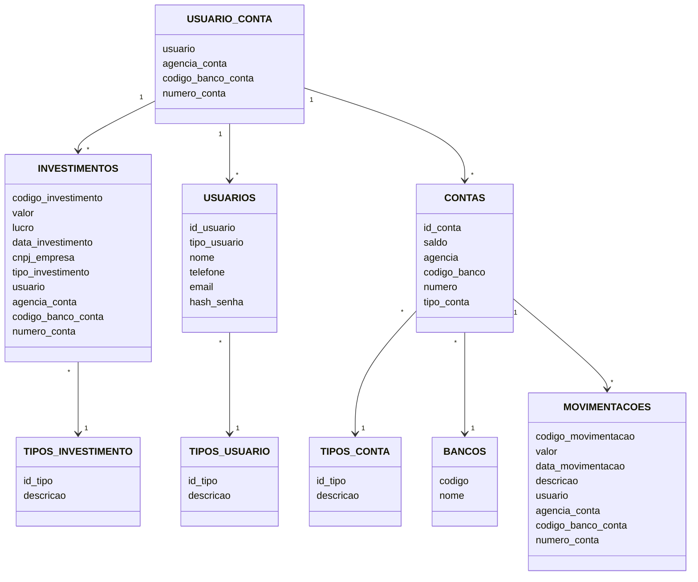

## 🏦 Descrição

XBank é um aplicativo fictício que reúne informações e utilidades de todas as contas bancárias que o usuário autenticar.

---

## ⚙️ Funcionalidades

- [x] Criar conta de usuário;
- [x] Fazer login (ainda é possível acessar as funcionalidades sem login);
- [ ] Criptografar senhas;
- [ ] Permitir acesso às funcionalidades somente com login;
- [x] Vincular contas bancárias;
- [x] Fazer transferências.

---

## 🛠 Tecnologias

As seguintes tecnologias foram utilizadas no desenvolvimento do projeto:

- **[HTML5](https://developer.mozilla.org/en-US/docs/Web/HTML)**
- **[CSS3](https://developer.mozilla.org/en-US/docs/Web/CSS)**
- **[JavaSE-15](https://www.oracle.com/java)**
- **[JSP](https://docs.oracle.com/cd/E13222_01/wls/docs81/jsp/intro.html)**
- **[Tomcat v10.0](https://tomcat.apache.org)**
- **[SQL Developer](https://www.oracle.com/database/sqldeveloper)**

---

## 📝 Licença

Projeto desenvolvido por [Igor Ribeiro](https://github.com/igor-u) e entregue como atividade do curso de Análise e Desenvolvimento de Sistemas da FIAP.

---

## 🖥️ Como usar

- Executar o script main/sql/fintech.sql em um banco de dados;
- Na classe com.fintech.database.FintechDBManager, alterar as credenciais de acesso ao banco de dados, no método DriverManager.getConnection("url", "user", "password");
- Inserir dados nas tabelas TIPO_USUARIO, TIPO_CONTA e BANCOS (na classe com.fintech.app.TesteConexaoInsert há exemplos de como fazer as inserções);
- Executar o front-end em um servidor.

---

## 🧩 Diagrama de classes

